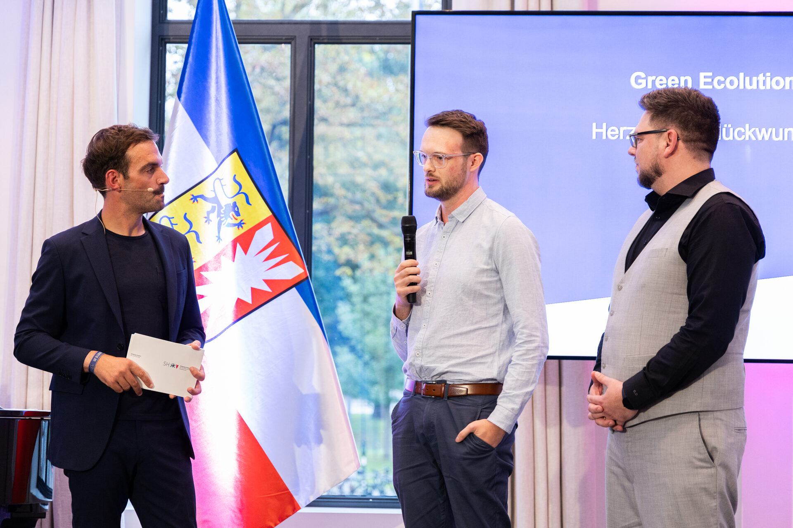
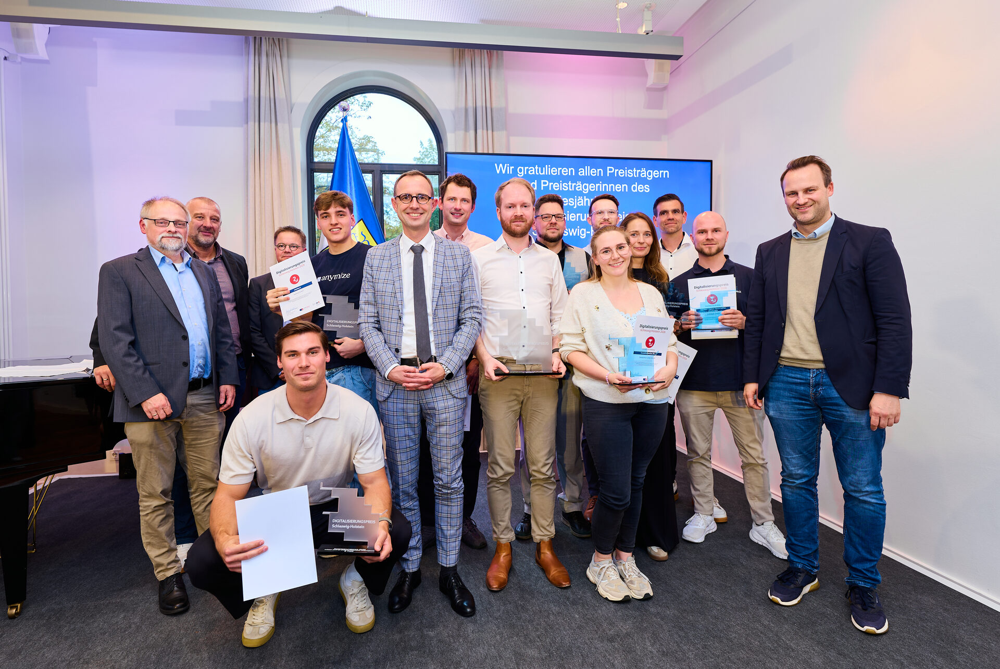

Green Ecolution has received the 2026 Digitalisierungspreis of the state of Schleswig-Holstein in the Green Coding special prize category. Digital minister Dirk Schrödter presented the award on the evening of 23 September at the state government's guest house in Kiel. It comes with 25,000 euros. The state has awarded the Digitalisierungspreis since 2018, and this is the first year with a dedicated special prize for green IT.

The application came from PROGEEK, where we are developing Green Ecolution towards production readiness within the state programme Offene Innovation. The special prize honours software that is economical with energy and resources. We are very glad to be the first to receive it.

## Green IT on two levels

Green Ecolution is green IT on two levels. The first is the software itself. The backend is written in Rust, modular and designed API first, extensions run through a plugin system, and we build on open standards. Because all of the code is open, anyone can check where it uses resources and suggest improvements. The soil moisture sensors send their readings over LoRaWAN, which needs very little energy. One battery lasts several years.

The second level is out on the street. Many municipalities plan their watering runs from experience today, without knowing which tree actually needs water right now. Green Ecolution shows that on a map and plans the route for the next run from it. Watering only where the soil is dry saves water. Avoiding empty runs saves diesel and CO₂. To us both levels belong together. The software should run economically itself and help save water and trips out on the street.

## Seven prizes in one evening

The state honoured seven projects that evening, with prize money adding up to around 95,000 euros. The jury included representatives of the state government, the association of cities, Digitale Wirtschaft Schleswig-Holstein and the Independent Centre for Privacy Protection.

First place and 25,000 euros went to Kiel start-up Silolytics. It has built a sensor and software platform for silage making that shows how much material, and which, sits in the silo during feed production. That lets farms adjust production so that as little feed as possible spoils. We like how close it is to our own project. There, too, sensors deliver the data a decision is made from, just on the farm instead of next to a street tree.

Second place and 15,000 euros go to anymize GmbH from Kiel. Their system automatically anonymises sensitive data before it reaches an AI model, so that companies with strict data protection rules can use AI as well, in medicine for example. Third place and 10,000 euros went to Revolvie from Kuden in Dithmarschen. Their software helps small businesses, especially in the trades, price quotes realistically and shows quickly whether a job pays off.

Besides our special prize there were three special prizes for education worth 6,500 euros each. They went to the Dentability Institut from Köhn, edaira GmbH from Kiel and Softstack GmbH from Flensburg.

## Thank you

Green Ecolution started as a master's project in applied computer science at Hochschule Flensburg, together with the Technisches Betriebszentrum Flensburg and the Smarte Grenzregion. Since October 2025 we have been developing the platform further with the city of Flensburg in the [state programme Offene Innovation](/blog/offene-innovation). The prize belongs to everyone who has worked on it, and to the TBZ, which is trying the application out in its daily work.

If you want to see for yourself, the demo is at [demo.green-ecolution.de](https://demo.green-ecolution.de) and the source code is on [GitHub](https://github.com/green-ecolution). And the [community vote](/blog/community-preis) at the Open Source Wettbewerb is still open until 30 September if you would like to vote for Green Ecolution.
