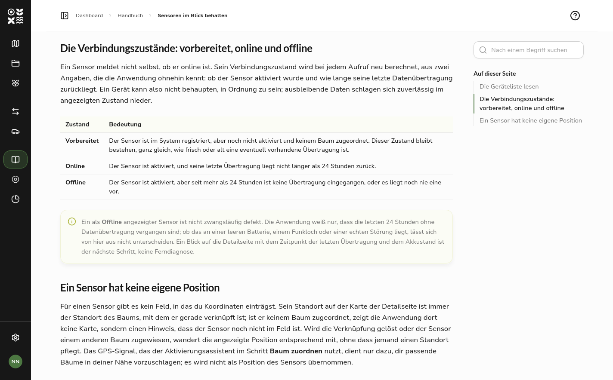
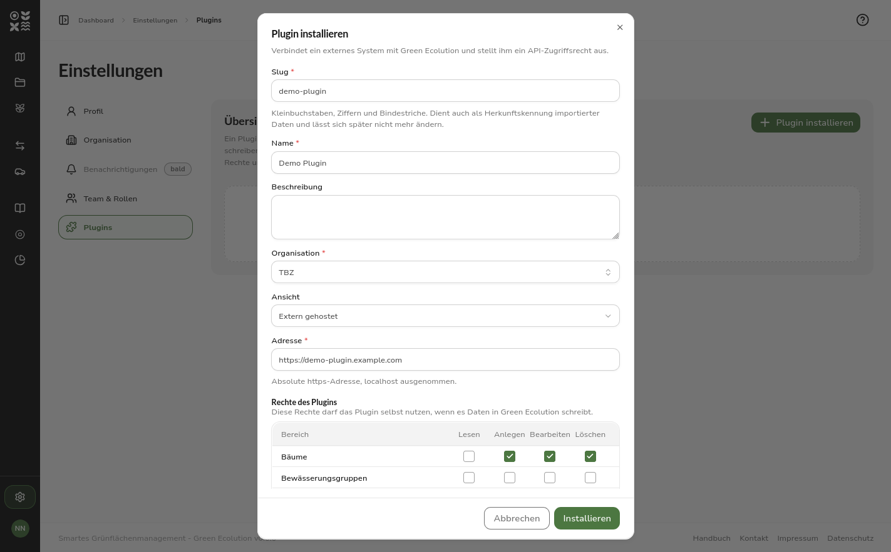
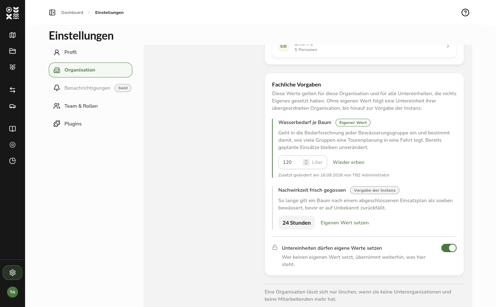
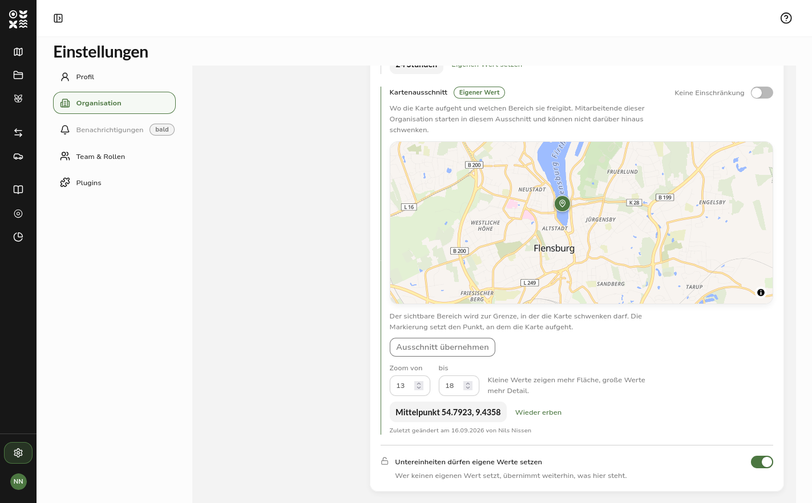
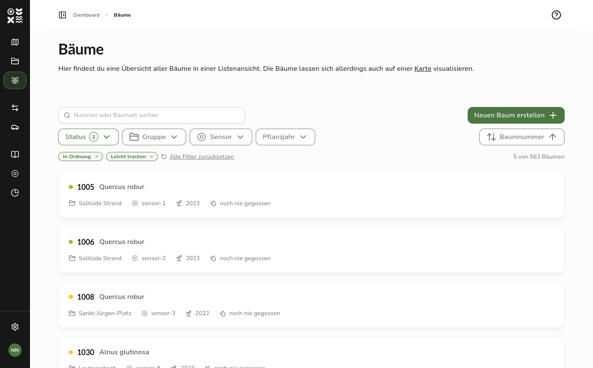

Wer Green Ecolution bisher kennenlernen wollte, musste sich die Bedienung in der Anwendung selbst erschließen oder im Team nachfragen. Version 0.7.0 bringt ein Nutzerhandbuch mit, das aus jeder Seite heraus erreichbar ist. Daneben stehen zwei Neuerungen in der Verwaltung: Externe Systeme lassen sich als Plugin anbinden, und jede Organisation legt ihre fachlichen Vorgaben selbst fest, statt sie instanzweit vorgegeben zu bekommen. Neu gebaut sind außerdem die Listen für Bäume, Bewässerungsgruppen, Fahrzeuge und Sensoren.

## Highlight des Releases

### Das Handbuch in der Anwendung

Das Handbuch umfasst 19 Kapitel in sechs Teilen, von den ersten Schritten über Karte, Bäume und Einsatzpläne bis zur Sensorik und zur Rechteverwaltung.

In der Kopfzeile oben rechts liegt ein Fragezeichen, das direkt in das Kapitel führt, das zur gerade geöffneten Seite gehört; für Seiten ohne eigenes Kapitel öffnet sich stattdessen die Übersicht. Dort lässt sich über alle Kapitel hinweg suchen, und wer lieber am Stück liest oder etwas ausdrucken möchte, lädt das vollständige Handbuch als PDF herunter.

Das Handbuch setzt keine Anmeldung voraus und richtet sich nicht nach Rollen. Wer wissen will, was die Anwendung leistet, bevor überhaupt eine Aufgabe zugeteilt ist, kann das vorab nachlesen.

## Neue Funktionen

### Plugins

Green Ecolution lässt sich um externe Systeme erweitern, ohne dass diese Teil der Anwendung werden. Der naheliegende Fall ist ein kommunales Baumkataster, das seinen Bestand laufend einspielt.

Ein Plugin registriert sich nicht selbst, sondern wird in den Einstellungen installiert, so wie ein Fahrzeug oder eine Rolle angelegt wird. Dabei bekommt es einen eigenen API-Schlüssel, über den es Bäume anlegen, aktualisieren und löschen kann. Der Schlüssel erscheint genau einmal im Klartext, gespeichert wird nur sein Hashwert; über die Detailseite lässt er sich jederzeit erneuern, etwa wenn ein Plugin den Betreiber wechselt.

Zusätzlich kann ein Plugin eine eigene Oberfläche mitbringen. Green Ecolution bettet sie in einem abgeschotteten Rahmen ein und übergibt ihr den Anzeigenamen, die Oberflächensprache und die Kennung des Plugins, aber keinen Zugriff auf die Anmeldedaten. Was ein Plugin selbst tun darf und wer seine Ansicht öffnen darf, sind zwei getrennte Rechtemengen: Die erste lässt sich nur bis zu den eigenen Rechten vergeben, die zweite entscheidet unabhängig davon, für welchen Personenkreis die Ansicht freigegeben ist. Die Ansicht eines Plugins kann deshalb auch öffnen, wer selbst keine Berechtigung zur Verwaltung von Plugins besitzt.

Die Funktion ist je Instanz abschaltbar und erscheint in der Einstellungsnavigation nur, wenn sie eingeschaltet ist und die eigene Rolle die Verwaltung von Plugins erlaubt.

### Fachliche Vorgaben je Organisation

Werte, die den Betrieb steuern, standen bisher in der Konfiguration der Instanz und galten damit für alle gleich. Eine Instanz, die mehrere Kommunen verwaltet, konnte sie nicht unterscheiden.

Die Detailansicht einer Organisation trägt jetzt den Abschnitt Fachliche Vorgaben. Dort steht der Wasserbedarf je Baum, der in die Bedarfsrechnung jeder Bewässerungsgruppe eingeht und damit bestimmt, wie viele Gruppen eine Tourenplanung in eine Fahrt legt. Daneben steht die Nachwirkzeit: Sie bestimmt, wie lange ein Baum nach einem abgeschlossenen Einsatzplan als soeben bewässert gilt.

Die Werte werden nach unten vererbt. Setzt eine Organisation keinen eigenen, übernimmt sie den ihrer übergeordneten, den Baum hinauf bis zur Vorgabe der Instanz. Ein Abzeichen neben dem Wert nennt seine Herkunft, darunter steht, wann und von wem er zuletzt geändert wurde. Ein geerbter Wert steht schlicht als Zahl da, denn es gibt nichts einzutragen, solange er von woanders kommt; erst über Eigenen Wert setzen wird ein Eingabefeld daraus, und Wieder erben verwirft ihn. Umgekehrt kann eine Organisation ihren Untereinheiten das Abweichen verwehren; dann gelten in ihrem gesamten Ast die Werte der sperrenden Organisation.

### Der Kartenausschnitt einer Organisation

Der dritte Wert in diesem Abschnitt ist der Kartenausschnitt. Er bestimmt, wo die Karte für die Mitarbeitenden einer Organisation aufgeht und welchen Bereich sie überhaupt freigibt. Bisher kam beides instanzweit aus der Konfiguration und zeigte jedem denselben Ort.

Ein Ausschnitt lässt sich über vier Koordinatenfelder schlecht beschreiben, deshalb wird er auf einer Karte festgelegt: schwenken und zoomen, bis der sichtbare Bereich dem Arbeitsgebiet entspricht, die Markierung an die Stelle ziehen, an der die Karte aufgehen soll, und den Ausschnitt übernehmen. Zwei Felder darunter begrenzen die Zoomstufen nach unten und nach oben.

Nicht jede Organisation arbeitet in einem abgegrenzten Gebiet. Ein Schalter hebt die Grenze deshalb ganz auf; erhalten bleibt dann nur der Mittelpunkt, denn aufgehen muss die Karte weiterhin irgendwo. Die Änderung greift, sobald eine Karte neu geöffnet wird. Wer die Karte bereits vor sich hat und darin verschoben hat, bleibt an seiner Stelle, und ein Link mit Koordinaten führt weiterhin dorthin, wohin er zeigt.

### Geplante Pflanzungen

Ein Pflanzjahr durfte bisher nicht in der Zukunft liegen. Eine beschlossene Pflanzung ließ sich damit erst erfassen, wenn der Baum bereits stand. Zukünftige Pflanzjahre sind jetzt zulässig, und die Stammdaten kennzeichnen einen solchen Baum als noch nicht gepflanzt.

Daraus folgt zweierlei, und die Anwendung erklärt es an Ort und Stelle: Der Baum bleibt ohne Bewässerungszustand, weil es noch keine Wurzeln gibt, um die herum sich Bodenfeuchte messen ließe, und er kann keinen Sensor tragen. Sobald das Pflanzjahr erreicht ist, verschwindet die Kennzeichnung von selbst.

Das Eingabefeld nimmt außerdem Kurzformen an. Aus 25 wird 2025, sobald das Feld verlassen wird, und es zeigt danach das volle Jahr, damit sichtbar ist, was gespeichert wird. Der Umschlagpunkt liegt zwanzig Jahre in der Zukunft, sodass 29 als 2029 und 85 als 1985 gelesen wird.

In diesem Zuge wurde ein Fehler behoben, der jedes Formular betraf: Eine abgewiesene Eingabe erzeugte überhaupt keine Rückmeldung. Die Schaltfläche zum Speichern blieb ausgegraut, ohne einen Grund zu nennen, und die Meldung zum beanstandeten Feld erschien nie. Die Schaltfläche lässt sich jetzt in jedem Fall betätigen, und die Meldung steht wieder am Feld.

## Verbesserungen

### Listen mit Suche, Filtern und Sortierung

Die Listen für Bäume, Bewässerungsgruppen, Fahrzeuge und Sensoren filterten und sortierten bisher im Browser, also nur innerhalb der gerade geladenen Seite. Bei einem Bestand von mehreren tausend Bäumen ist das nicht brauchbar.

Suche, Filter und Sortierung laufen jetzt auf dem Server und damit über den gesamten Bestand. Jede Liste hat ein Suchfeld, darunter eine Reihe von Filtern, die ohne Bestätigung sofort wirken, und ein Sortiermenü. Was gesetzt ist, erscheint darunter als entfernbarer Chip, daneben stehen ein Link zum Zurücksetzen und die Anzahl der Treffer. Wird die Auswahl eines Filters lang, bringt sie ein eigenes Suchfeld mit, über das sich die Optionen einengen lassen.

Suchbegriff, Filter, Sortierung und Seite stehen in der Adresszeile. Eine gefilterte Ansicht lässt sich damit als Link weitergeben, und der Zurück-Schalter des Browsers macht eine Filteränderung rückgängig.

Die Zeilen selbst sind ebenfalls überarbeitet. Der Bewässerungszustand eines Baums, der Status eines Fahrzeugs und der Verbindungszustand eines Sensors stehen als farbiger Punkt vor dem Namen, was am Ende der Zeile Platz für weitere Angaben schafft: bei Bäumen das Pflanzjahr und die letzte Bewässerung, bei Fahrzeugen die Führerscheinklasse. Auf schmalen Bildschirmen entfallen sie wieder, damit die Zeile nicht umbricht. Bei den Sensoren nennt die Zeile jetzt die Bewässerungsgruppe des verknüpften Baums, und nach ihr lässt sich auch suchen und filtern, denn so ist die Arbeit im Feld organisiert.

Baumnummern werden dabei als Zahl verglichen und nicht als Text: 9 steht vor 1005, und Nummern mit einem Buchstaben davor bilden eigene Blöcke, in denen wieder numerisch sortiert wird.

### Der Status eines Fahrzeugs

Der Status eines Fahrzeugs war ein Feld im Formular, und einer seiner Werte war Im Einsatz. Beim Start oder Ende eines Einsatzplans setzte ihn niemand, also blieb ein Fahrzeug im Einsatz, bis jemand daran dachte, es von Hand zurückzusetzen.

Eingetragen wird jetzt nur noch die Verfügbarkeit, also der Teil, den ein Mensch tatsächlich weiß, etwa ein Werkstattaufenthalt. Ob ein Fahrzeug gerade unterwegs ist, leitet die Anwendung aus den Einsatzplänen ab: Es gilt als unterwegs, solange es einem Einsatzplan mit dem Status Aktiv zugeordnet ist. Nicht verfügbar hat dabei Vorrang vor einem laufenden Einsatzplan, denn wer ein Fahrzeug in die Werkstatt gibt, weiß mehr als ein Einsatzplan, den jemand zu beenden vergessen hat.

### Das Board der Einsatzpläne

Ein versehentlich gestarteter Einsatzplan ließ sich auf dem Board nicht zurückziehen. Die Spalte Geplant wurde ausgegraut, sobald eine Karte aus Unterwegs herausgezogen wurde, und die Korrektur lief über den Statusdialog oder über die Rückgängig-Meldung, solange diese noch stand. Die Karte lässt sich jetzt zurück nach Geplant ziehen, die Spalte zeigt dabei den Hinweis Start zurücknehmen.

Der Status Unbekannt ist aus der Einsatzplanung verschwunden. Er war der Nullwert der früheren Implementierung und kein Zustand, den ein Einsatzplan je erreichte, machte sich in der Oberfläche aber bemerkbar: Er diente als Rückfallwert für einen unbekannten Status, führte zu einem Statusdialog ohne Auswahlmöglichkeiten und ließ die betroffene Karte auf dem Board verschwinden.

## Behobene Fehler

### Karte

Im Panel der Karte konnten Inhalte aus dem weißen Bereich herauslaufen, sobald mehrere Fehlermeldungen es verlängerten. Betroffen war ausgerechnet die Schaltfläche zum Speichern, die dann nicht mehr erreichbar war. Das Panel scrollt jetzt innerhalb seines Rahmens, die Kopfzeile mit dem Schließen-Schalter bleibt dabei stehen. In der Auswahlliste für Bäume und Gruppen hat der wachsende Bereich außerdem eine Untergrenze, sodass er nicht mehr auf null zusammenfällt.

### Handbuch-Download

In der installierten App lieferte der Download des Handbuchs eine Seite der Anwendung unter dem Dateinamen des PDF aus. Der Zwischenspeicher der installierten App beantwortete die Anfrage selbst, statt sie an den Server weiterzureichen. Der Download des Handbuchs geht jetzt immer an den Server.

### Fehlerseite

Auf der Fehlerseite lief die Kabel-Illustration quer durch den Text, und der Stecker schwebte in der Mitte des Bildschirms. Sie steht jetzt über dem Text, und ihre Höhe ist in hohen Fenstern begrenzt.

## Ausblick

Das Handbuch liegt vorerst nur auf Deutsch vor. Auf einer englisch eingestellten Oberfläche erscheinen die Kapitel deshalb auf Deutsch, mit einem entsprechenden Hinweis darüber. Die Übersetzung ist der nächste Schritt.

Bei den Plugins ist ein dritter Modus vorbereitet, aber noch nicht auswählbar: eine Ansicht, die nur intern läuft und von Green Ecolution durchgereicht wird. Bis dahin lässt sich entweder eine öffentlich erreichbare Adresse angeben oder gar keine Ansicht.

Die Freigabe einzelner Ressourcen an Unterorganisationen, im Ausblick von [0.6.0](/de/releases/v0.6.0) genannt, steht weiterhin aus. Sie bleibt der nächste größere Schritt beim Rechtemodell, damit eine beauftragte Firma einen Bestand betreuen kann, ohne dass er ihr übertragen wird.

Rückmeldungen und Fehlerberichte sind jederzeit willkommen auf [GitHub](https://github.com/green-ecolution/green-ecolution/issues).
